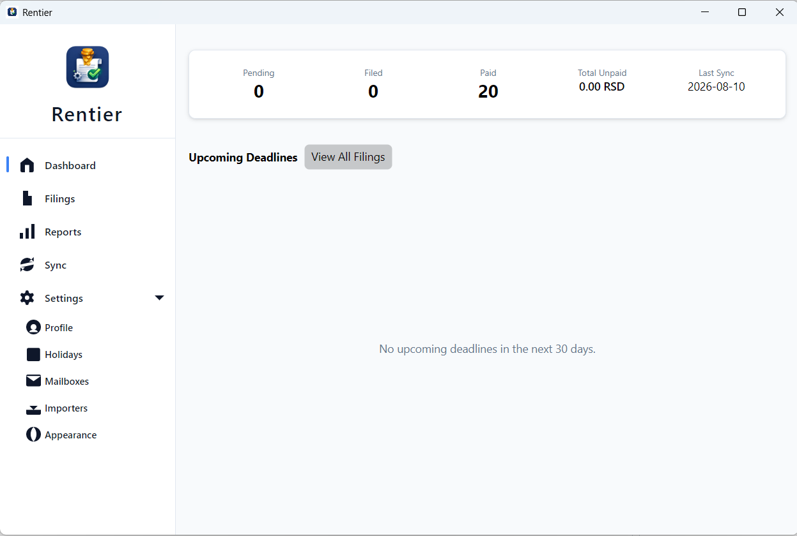
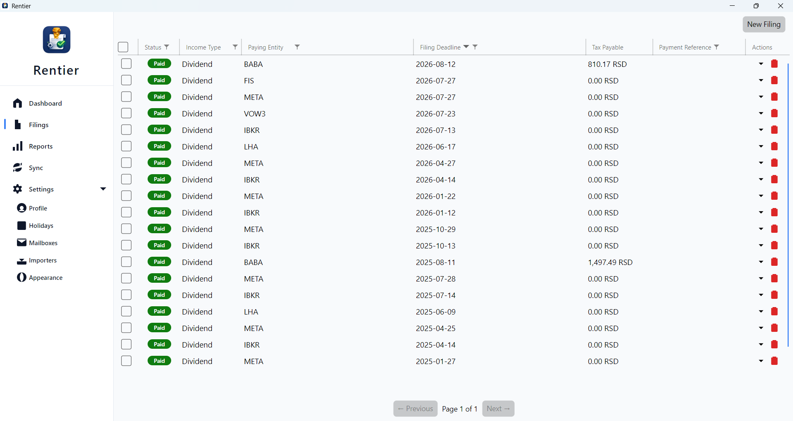
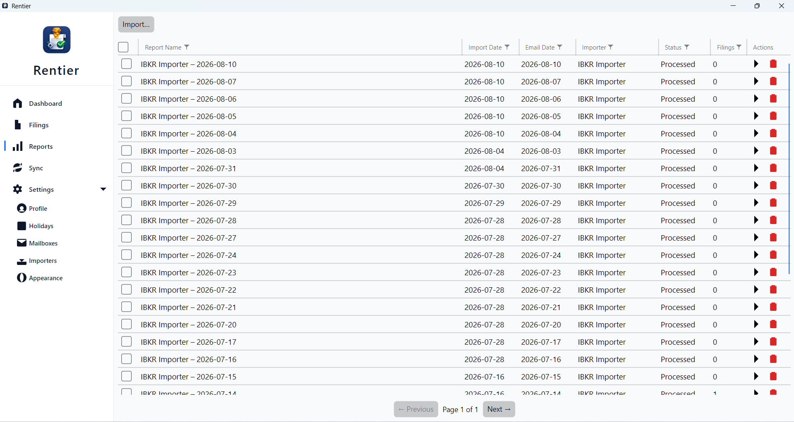

# Rentier

[](https://opensource.org/licenses/Apache-2.0)
[](https://dotnet.microsoft.com/)
[](#project-status)

**Rentier** is a cross-platform desktop application that helps Serbian taxpayers prepare **PP-OPO tax filings** for passive income (dividends and interest) received through foreign brokers such as Interactive Brokers (IBKR).

It reads your IBKR Activity Statement, fetches NBS exchange rates for each income date, calculates the 15% Serbian income tax, applies any foreign withholding tax credit, and produces a ready-to-submit PP-OPO XML file — one per income event.

> **Disclaimer:** Rentier is a productivity tool, not a licensed tax advisory service. Always verify your filings with a certified Serbian tax advisor.

---

## Documentation

### English
| Guide | Description |
|---|---|
| [Getting Started](GETTING-STARTED.md) | Install the app, create your taxpayer profile, and import your first statement |
| [IBKR Activity Statement Setup](IBKR-SETUP.md) | How to generate the right CSV from IBKR and connect it to Rentier |
| [Serbian PP-OPO Tax Overview](TAX-OVERVIEW.md) | How the Serbian passive income tax works and what Rentier calculates |

### Srpski (Serbian)
| Vodič | Opis |
|---|---|
| [Prvi koraci](docs/sr-RS/PRVI-KORACI.md) | Instalirajte aplikaciju, kreirajte svoj profil poreskog obveznika i uvezite svoju prvu IBKR izjavu |
| [IBKR Activity Statement instalacija](docs/sr-RS/IBKR-INSTALACIJA.md) | Kako da generišete ispravan CSV iz IBKR-a i da ga povežete sa Rentier-om |
| [Pregled srpskog PP-OPO poreza](docs/sr-RS/PREGLED-POREZA.md) | Kako funkcioniše srpski porez na pasivni dohodak i šta Rentier izračunava |

### Screenshots

| Dashboard | Filings | Reports |
|---|---|---|
|  |  |  |

---

## How It Works

```
IBKR Activity Statement (CSV)
        │
        ▼
  Rentier parses Dividends,
  Interest & Withholding Tax rows
        │
        ▼
  NBS exchange rate fetched
  for each income date
        │
        ▼
  Tax calculated: 15% of gross
  income minus foreign WHT credit
        │
        ▼
  PP-OPO XML exported
  (one file per income event)
        │
        ▼
  You upload to ePorezi portal
  and mark Filing as Filed/Paid
```

---

## Features

✅ **IBKR CSV Import** – Parses Activity Statements: dividends, interest, and withholding tax  
✅ **Tax Calculation** – 15% Serbian income tax with automatic foreign withholding credit  
✅ **NBS Exchange Rates** – Auto-fetches and caches Serbian National Bank mid-rates per date  
✅ **PP-OPO XML Export** – Generates submission-ready XML for the ePorezi portal  
✅ **Filing Lifecycle** – Tracks each filing through Init → Filed → Paid  
✅ **Deadline Calculation** – 30-day deadline adjusted for weekends and Serbian public holidays  
✅ **Email Automation** – Monitors an IMAP mailbox for new IBKR statements and imports automatically  
✅ **Secure Credentials** – OS-level credential store; no passwords stored in SQLite  
✅ **Multi-Year Support** – Manage filings across multiple tax years  

---

## Prerequisites

- **Windows 10 / Ubuntu 20.04 / macOS 12 or later**
- **.NET 10.0 Runtime** — [download](https://dotnet.microsoft.com/download)
- An **Interactive Brokers** account with activity to report
- A **Serbian taxpayer identification number** (JMBG)

---

## Quick Start

1. **Build and run** the application (see [Getting Started](GETTING-STARTED.md))
2. **Create your taxpayer profile** — enter your JMBG, full name, address, and municipality code
3. **Configure an Importer** — link it to your profile and choose how statements arrive (manual upload or email)
4. **Import a statement** — upload an IBKR CSV or trigger a mailbox sync
5. **Process the report** — Rentier calculates taxes and generates filings
6. **Export PP-OPO XML** for each filing and submit via [ePorezi](https://www.purs.gov.rs/e-porezi.html)
7. **Mark filings as Filed**, then **Paid** once the tax payment clears

---

## Technology Stack

| Area | Technology |
|---|---|
| Language | C# 14 |
| Framework | .NET 10.0 |
| UI | Avalonia (MVVM, cross-platform) |
| Database | SQLite via Entity Framework Core |
| Architecture | Clean Architecture + CQRS |
| Testing | xUnit, FluentAssertions, NSubstitute |
| Email | MailKit (IMAP) |
| HTTP | HttpClient typed client pattern |

---

## Developer Guide

### Architecture

Rentier follows **Clean Architecture** with strict layer separation:

```
Rentier.Domain          → Pure C# records, value objects, domain logic (no external deps)
  ↑
Rentier.Application     → CQRS commands/queries, business rules, IRepository interfaces
  ↑
Rentier.Infrastructure  → EF Core, NBS scraper, IMAP sync, credential store
  ↑
Rentier.Desktop         → Avalonia UI, ReactiveUI ViewModels
```

**Key patterns:**
- **CQRS** – Commands (`*Command`) and Queries (`*Query`) with corresponding handlers
- **Result pattern** – Infrastructure returns `Result<T, Error>` (no exception-as-control-flow)
- **Value objects** – `Money`, `MailboxCursor`, `HolidayConf` enforce domain invariants
- **Dependency injection** – Composition root in `Rentier.Desktop/Composition/`

### Clone & Build

```bash
git clone https://github.com/djordje.milenkovic96/rentier.git
cd rentier
dotnet restore
dotnet build
```

### Run the Application

```bash
dotnet run --project src/Rentier.Desktop/Rentier.Desktop.csproj
```

### Run Tests

```bash
# All tests
dotnet test

# With coverage (requires coverlet)
dotnet test /p:CollectCoverage=true /p:CoverageFormat=opencover

# Skip external integration tests (NBS API etc.)
dotnet test --filter "Category!=Integration"
```

### Implementation Guidelines

**Domain Layer** (`Rentier.Domain/`)
- Pure C# records, no external dependencies
- Enforce business rules in value object constructors
- Use `DomainException` for invalid state transitions

**Application Layer** (`Rentier.Application/`)
- Create `*Query`/`*Command` records in `Commands/` or `Queries/`
- Implement `*QueryHandler`/`*CommandHandler` in `Handlers/`
- Define repository interfaces in `Repositories/`

**Infrastructure Layer** (`Rentier.Infrastructure/`)
- Implement EF Core repositories
- Add migration: `dotnet ef migrations add MigrationName`
- Implement external service clients (NBS, IMAP, etc.)

**Desktop/UI** (`Rentier.Desktop/`)
- `*ViewModel` → calls Application use cases via `IMediator.Send()`
- All async: use `ReactiveCommand.CreateFromTask()`
- Bind to observables only — no event handlers in code-behind

### Monetary Values & Dates

Always use:
- `decimal` for all money amounts, tax rates, and exchange rates
- `DateOnly` (not `DateTime`) for all date-only values; convert at infrastructure boundary

### Async/Await Standards

```csharp
// ✅ Good
public async Task<Result<Filing>> ProcessAsync(CancellationToken ct)
{
    var filing = await _repository.GetAsync(id, ct);
    return Result.Ok(filing);
}

// ❌ Bad — blocks the thread
public Task<Filing> Process() => Task.FromResult(_repository.Get(id).Result);
```

### Testing Conventions

Tests live in `tests/Rentier.*.Tests/`. Naming: `MethodName_StateUnderTest_ExpectedBehavior`.

**Domain tests** — pure logic, no mocks:
```csharp
[Fact]
public void AdvanceStatus_InitToFiled_Succeeds()
{
    var filing = Filing.CreateFromIncome(...);
    filing.AdvanceStatus(FilingStatus.Filed);
    filing.Status.Should().Be(FilingStatus.Filed);
}
```

**Application tests** — mock repositories with NSubstitute:
```csharp
[Fact]
public async Task ProcessReportsCommandHandler_WithValidReports_CreatesFilings()
{
    var mockRepo = Substitute.For<IReportRepository>();
    var handler = new ProcessReportsCommandHandler(mockRepo, ...);
    var result = await handler.Handle(new ProcessReportsCommand(...), CancellationToken.None);
    result.IsSuccess.Should().BeTrue();
}
```

**Integration tests** — real EF Core SQLite in-memory:
```csharp
[Fact, Trait("Category", "Integration")]
public async Task NbsExchangeRateFetcher_FetchesRates_CachesResults()
{
    // Uses real HttpClient with fake handler
}
```

### Commit Message Convention

```
feat: Add NBS exchange rate fetcher
fix: Correct holiday deadline calculation
refactor: Extract MailboxSyncService logic
test: Add edge cases for filing status transitions
docs: Update IBKR setup guide
chore: Update dependencies
```

---

## Contribution Guidelines

We welcome contributions! Before opening a pull request:

1. **Fork** this repository
2. **Create** a feature branch (`git checkout -b feature/descriptive-name`)
3. **Follow** the implementation guidelines above
4. **Write tests** — Domain, Application, and UI layers all require coverage
5. **Run tests locally** — `dotnet test`
6. **Commit** using conventional commit messages
7. **Push** and open a **Pull Request** with a clear description

### Code Review Expectations

- Clean Architecture layer boundaries are preserved
- No passwords or secrets in source code
- All async methods accept and forward `CancellationToken`
- `decimal` for monetary values, `DateOnly` for dates
- No `.Result` or `.Wait()` blocking calls
- Tests follow xUnit + FluentAssertions naming conventions

---

## Roadmap

- [ ] Multi-account support (multiple IBKR accounts / taxpayer profiles)
- [ ] Bulk filing export (all filings for a tax year in one action)
- [ ] Alternative statement providers (Revolut, Wise, etc.)
- [ ] Linux/macOS Avalonia UX improvements (theming, system integration)

---

## Support & Issues

- **Bug reports** — Open an [issue](../../issues) with reproduction steps and the relevant CSV section
- **Feature requests** — Use [discussions](../../discussions) or file an issue with the `enhancement` label
- **Questions** — Check existing issues and discussions first

---

## License

This project is licensed under the **Apache License 2.0** — see [LICENSE](LICENSE) for details.

## Authors

- **Djordje Milenkovic**

## Acknowledgments

- [Avalonia](https://avaloniaui.net/) for the cross-platform MVVM UI framework
- [MailKit](https://github.com/jstedfast/MailKit) for IMAP email sync
- [Entity Framework Core](https://learn.microsoft.com/en-us/ef/core/) for data access
- [Serbian National Bank (NBS)](https://www.nbs.rs/) for exchange rate services
